# k8s-implementation
This is my first attempt at implementing my Kubernetes cluster. In this process, I face a lot of challenges and I will write all these items here.

## Cluster Specification

- Load-balancer: HaProxy
- 3 Master Nodes + 1 Worker Node
- Kubeadm implementation method / Kubespray

- CRI: Docker
- CNI: Calico
- CSI: OpenEBS
- Ingress: Nginx

Network:

Load-balancer: 192.168.32.5 + Public interface

Master Nodes:
- Master-1: 192.168.32.10
- Master-2: 192.168.32.20
- Master-3: 192.168.32.30

Worker Node:
- Worker-1: 192.168.32.40

## Links

[wordpress.aminmr.ir](wordpress.aminmr.ir)

[prom.aminmr.ir](prom.aminmr.ir)

[grafana.aminmr.ir](grafana.aminmr.ir)

[nginx.aminmr.ir](nginx.aminmr.ir)

## OS Challenges via IaaS

1. The most important challenge was the private network gateway. If you have multiple interfaces on one VM(Public and Private), You do not need this feature, and you need to disable it via IaaS Panel.

   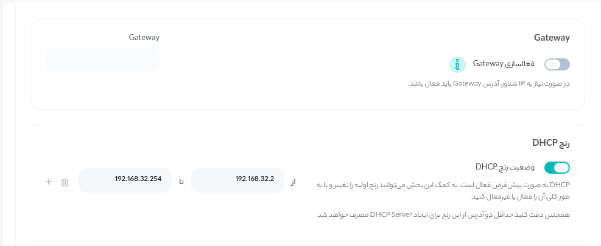

2. My Haproxy node has not gotten the local IP address automatically via netplan. The problem after too many attempts was about the interface MAC Address. So always check out the interface's MAC Address through IaaS Panel.

   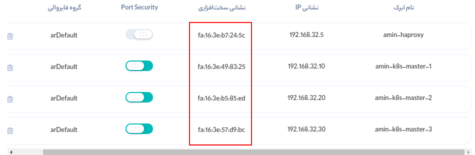

3. After migration of master-2(Migrate the host via Openstack-CLI) the filesystem has corrupted and the docker service has not to start anymore. So I needed to use fsck tools in rescue mode to repair the filesystem.

   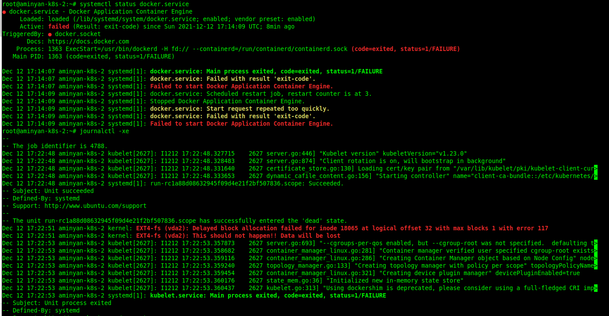

This failure and fsck lost metadata of docker. There is no solution and you should just delete the `/var/lib/docker` data and restart the docker!

### UFW DNS Problem
This problem hasn't compeletely undrestand for me!:
Because of my own decision I disabled DHCP for all nodes and enable NAT to the haproxy node. Everything was ok until enabling the UFW firewall. After enabling the firewall DNS resolution got problem! After many research I checked the [linuxize](https://linuxize.com/post/how-to-setup-a-firewall-with-ufw-on-ubuntu-20-04/#ip-masquerading) article and changed ufw setting and it got fixed!

**Update:** In my forough cluster this problem was fixed everytime by one disable\ enabling the ufw!

## Kubernetes Challenges

 For the first time, I implemented Kubernetes via `Kubeadm`. This method of implementation was common and has its challenges:

1. In the process of installation, the `kubeadm init` command was not run correctly. The error is related to kubelet and docker(CRI). After reading the logs I found that the problem was related to `cgroup`. The cgroup of kubelet and docker was not the same and caused the problem.

   The solution:

   Add the following lines to `/etc/docker/daemon.json` and restart the docker service to change the docker cgroup to systemd:

   ```shell
   {
           "exec-opts": ["native.cgroupdriver=systemd"]
   }
   ```

   **Note:** In Kubernetes documentation, the best practice was using the `systemd`  related to the performance and etc.

   

2. After Kubernetes implementation, the API and etcd components were restarted repeatedly. The logs were following:

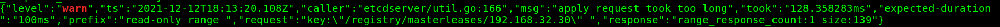

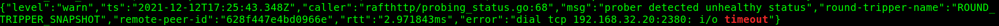

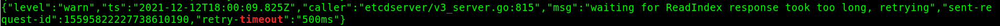

after reading these logs I was checked the disk latency. The disk latency was unbelievable!

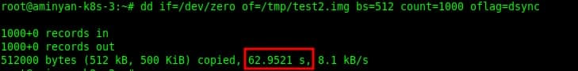

62 seconds! I have checked the exact command on multiple region(Mobinnet , Amsterdam, etc) and the result was much better:

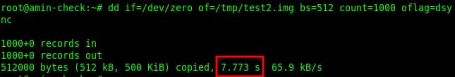

So to help the etcd work fine as mentioned in the Kubernetes documents, I added volumes to VMs and after backup the etcd, mount volumes to the `/var/lib/etcd` .

### Scenario 1 

For Disk migration on the Openstack Volumes, I prefer to try multiple scenarios to try the etcd actions and understanding etcd cluster.

In the first scenario I tried the following steps:

1.  Stop Docker and Kubelet on one of the master nodes.
2. mount the disk on `/var/lib/etcd` 
3. Start the Docker and Kubelet

After the above steps, the etcd on our node was failed. After reading the logs, the following logs was `warning` logs that should be considered:

1. After mounting the disk to `/var/lib/etcd` there was a `lost+found` directory that should be deleted.
2. The permission was set to default permission(755). The recommended permission for etcd data directory is 700.
3. The fatal error was about `cluster ID mismatch`. Unfortunately, the etcd cluster will not repair our specific member! 

So I tried to remove the member from the cluster and rejoin it. I tried the following commands:

```shell
sudo ETCDCTL_API=3 etcdctl  --endpoints=https://192.168.32.10:2379,https://192.168.32.20:2379,https://192.168.32.30:2379  --cert=/etc/kubernetes/pki/etcd/server.crt  --key=/etc/kubernetes/pki/etcd/server.key  --cacert=/etc/kubernetes/pki/etcd/ca.crt  member remove 49aecc6b82b2b4ae
```

Next, for adding the member:

```shell
sudo ETCDCTL_API=3 etcdctl  --endpoints=https://192.168.32.10:2379,https://192.168.32.20:2379,https://192.168.32.30:2379  --cert=/etc/kubernetes/pki/etcd/server.crt  --key=/etc/kubernetes/pki/etcd/server.key  --cacert=/etc/kubernetes/pki/etcd/ca.crt  member add aminyan-k8s-2 --peer-urls=https://192.168.32.20:2380,https://192.168.32.30:2379
```

but after adding the member to the cluster and restarting the pod(remove/recreate) the member state was `unstarted` on the cluster! So after all these tries, we try the second scenario to restore the etcd member...

### Scenario 2 

So after failure in scenario 1 after mounting the disk on `/var/lib/etcd` we need to restore etcd backup. First of all list all etcd member:

```shell
sudo ETCDCTL_API=3 etcdctl  --endpoints=https://192.168.32.10:2379,https://192.168.32.20:2379,https://192.168.32.30:2379  --cert=/etc/kubernetes/pki/etcd/server.crt  --key=/etc/kubernetes/pki/etcd/server.key  --cacert=/etc/kubernetes/pki/etcd/ca.crt  member list -w table
```

 and then by following command you can make a snapshot:

```shell
sudo ETCDCTL_API=3 etcdctl --endpoints https://192.168.32.10:2379,https://192.168.32.20:2379,https://192.168.32.30:2379 --cert=/etc/kubernetes/pki/etcd/server.crt  --key=/etc/kubernetes/pki/etcd/server.key  --cacert=/etc/kubernetes/pki/etcd/ca.crt snapshot save /home/ubuntu/snapshot-12-19-1.db
```

Now copy the snapshot file to the node you want to recover and follow the command:

```shell
sudo ETCDCTL_API=3 etcdctl  --endpoints https://192.168.32.20:2379  --cert=/etc/kubernetes/pki/etcd/server.crt  --key=/etc/kubernetes/pki/etcd/server.key  --cacert=/etc/kubernetes/pki/etcd/ca.crt  --initial-cluster=aminyan-k8s-2=https://192.168.32.20:2380,aminyan-k8s-master-1=https://192.168.32.10:2380,aminyan-k8s-3=https://192.168.32.30:2380  --initial-cluster-token=etcd-cluster-1  --initial-advertise-peer-urls=https://192.168.32.20:2380  --name=aminyan-k8s-2  --skip-hash-check=true  --data-dir /var/lib/etcd/amin snapshot restore /root/snapshot-12-19.db
```

**Notes:**

1. `--initial-cluster-token=etcd-cluster-1` could be any name.
2. Because when you want to restore snapshot the `--data-dir` should not be existed, so we need to restore the etcd on another directory! Be careful you need to change the data directory in `etcd.yaml` (/etc/kubernetes/manifests/etcd.yaml)

To check the endpoint health you can use the following command:

```shell
sudo ETCDCTL_API=3 etcdctl  --endpoints=https://192.168.32.10:2379,https://192.168.32.20:2379,https://192.168.32.30:2379  --cert=/etc/kubernetes/pki/etcd/server.crt  --key=/etc/kubernetes/pki/etcd/server.key  --cacert=/etc/kubernetes/pki/etcd/ca.crt  endpoint health

```

**Lessons:** The etcd cluster needs the data to get recover. If the data was deleted on one node, you only have to restore other etcd member's snapshots.

### Kubespray Challenges

The Config file and hosts yaml of Kubespray implementation way was stored on this git repository but in this section I writing about the challenges I face:

#### Firewall Problem

After executing the ansible-playbook and when the cluster was up, the `calico` pods are crashed. After checking the pod's log I found that the Calico BGP network sockets and etc can't communicate with each other! By disabling the firewall the pods are getting running! In Calico documentation you need to allow the following ports:

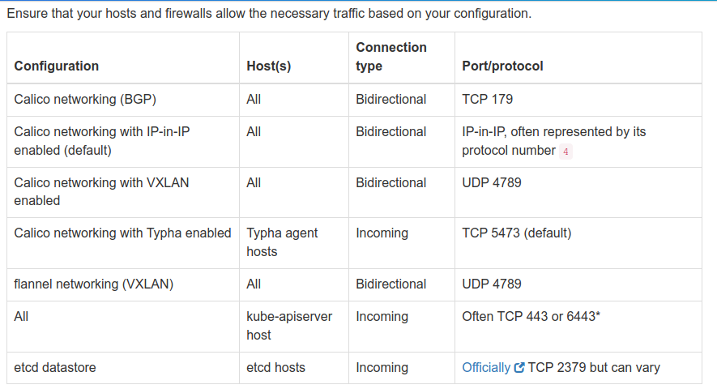

### Hostnames Renaming!

After deploying the k8s with kubespray ansible-playbook, by my mistake, I forgot to rename the hostnames in inventory files. So the kubespray rename the OS hostnames and sync it to the inventory file!

So  I need a way to rename the hostnames, but all the Kubernetes components depend on the hostname!

To solve the problem I've done many mistakes:

1. Try to remove one of the nodes manually and rejoin it to the cluster. Don't ask what happened!
2. After that before running `remove-node.yaml` kubespray playbook, I run `cluster.yaml` again with new hostnames in the inventory file. It completely ruined the cluster. Never ever run the `cluster.yaml` again before removing the nodes.

### Solution

To rename the hostnames, you just need to first execute the `remove-node.yaml` and rejoin the node via `cluster.yaml` again.

#### Pod's eviction problem

After all I've done, I tried to run`remove-node.yaml` or `reset.yaml` but the playbook froze on some steps. So I tried to drain nodes and delete them manually. The nodes are frozen on the draining process. After googling on it I found the [solution](https://medium.com/@felipedutratine/when-you-try-to-drain-a-kubernetes-node-but-it-blocks-5aba9592d7c9).

The problem was pods that came to a `terminating` state but were blocked!

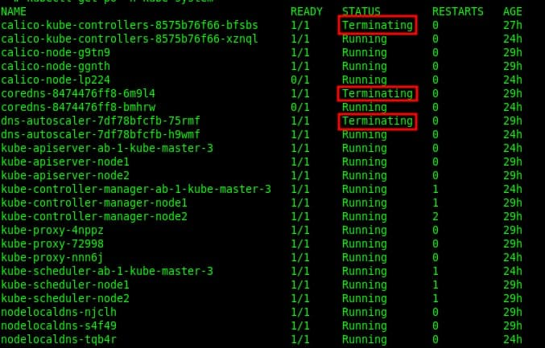

 So I delete pods by force:

```shell
kubectl delete pod <pod_name> -n=<namespace> --grace-period=0 --force
```

### Misconfiguration in Kubespray

After redeploying the k8s, the CoreDNS pod was crashed! The error in the description of pods was:

```shell
Warning  FailedCreatePodSandBox  5m17s                kubelet            Failed to create pod sandbox: rpc error: code = Unknown desc = failed to setup network for sandbox "958cb4c2c74154b1f734689afbbe99d675e4e771f6bf635fc1f71edb3ac9dc59": error getting ClusterInformation: Get "https://[10.171.128.1]:443/apis/crd.projectcalico.org/v1/clusterinformations/default": context deadline exceeded
```

It could not connected to pod networks! I tried many solutions but nothing worked. At last I found the solution on [this](https://issueexplorer.com/issue/projectcalico/calico/5014) website:

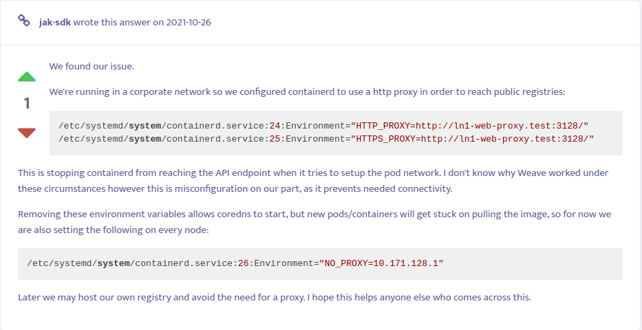

Yeah! That's right! I indeliberately config No_Proxy and it was the mistake:

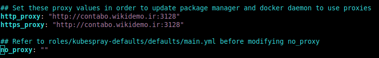

 I manually removed the no_proxy from `vim /etc/systemd/system/containerd.service.d/http-proxy.conf` file and restart the containerd. The problem has solved!

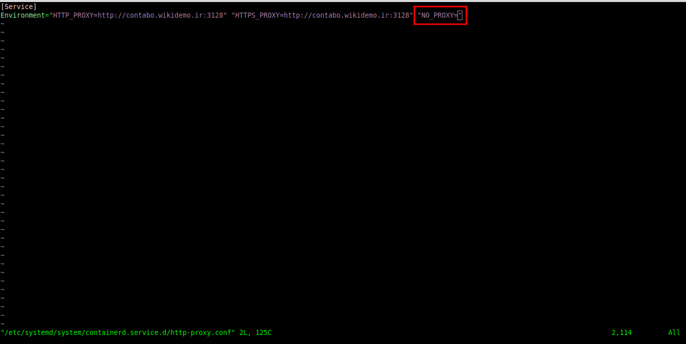

## E2E test on Kubernetes Cluster

After all the redeploying and disk problems on Arvan Asiatech IaaS, I decided to try end to end test on my cluster.

First of all you need to install golang:

```shell
wget https://go.dev/dl/go1.17.5.linux-amd64.tar.gz
rm -rf /usr/local/go && tar -C /usr/local -xzf go1.17.5.linux-amd64.tar.gz
export PATH=$PATH:/usr/local/go/bin
go version
```

clone the `test-infra` repository:

```shell
git clone https://github.com/kubernetes/test-infra.git
```

and execute the following command:

```
GO111MODULE=on go install ./kubetest
```

