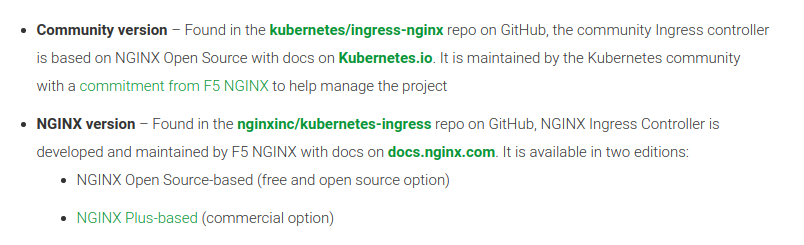

# Ingress Controllers

There are lots of popular Ingress Controller which can be deployed for use in the Kubernetes Cluster.

In this section, I'm going to deploy multiple Ingress controllers and write about my experience and deploy method and challenges :))

## My Misundrestanding!

There are two types of Nginx ingress controllers. Kubernetes community version and Nginx version.

Be careful :)
