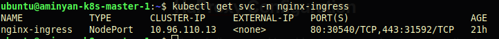

# k8s Community Ingress Controller

## Installation

For installing the community version you can read the [related document](https://kubernetes.github.io/ingress-nginx/deploy/). I chose the Helm method to deploy the ingress controller.

### Installing Helm

If you installed your kubernetes cluster via `Kubespray` you can add installing helm in `addons.yaml`. Otherwise, you can install the helm manually:

```shell
curl -fsSL -o get_helm.sh https://raw.githubusercontent.com/helm/helm/main/scripts/get-helm-3
chmod 700 get_helm.sh
./get_helm.sh
```

 ‍‍‍‍Now you can install the kubernetes ingress via Helm:

```shell
helm upgrade --install ingress-nginx ingress-nginx \
  --repo https://kubernetes.github.io/ingress-nginx \
  --namespace ingress-nginx --create-namespace
```

And after that check if all things are up:

```shell
kubectl get all -n ingress-nginx
```

For further reading, you can read the official documents on:

https://kubernetes.github.io/ingress-nginx/deploy/#installation-guide 

### HaProxy

Now after the installation, you need to configure the Haproxy. First, check out the NodePort which assigned to the ingress  `svc`:

```shell
kubectl get svc -n ingress-nginx
```



And now it's time to configure the Haproxy config:

```shell
frontend kubernetes-ingress-http
    bind *:80
    default_backend kubernetes-nodes-http

backend kubernetes-nodes-http
    mode http
    balance roundrobin
    option tcp-check
    server kmaster1 192.168.32.10:30540 check fall 3 rise 2
    server kmaster2 192.168.32.20:30540 check fall 3 rise 2
    server kmaster3 192.168.32.30:30540 check fall 3 rise 2
```

After these configurations restart the Haproxy and test the connection by using curl and you will get `404 page not found` if everything is fine.

By the end you can deploy simple nginx by applying `nginx-deployment.yaml` and `ingress-resource.yaml` to test  your ingress.

