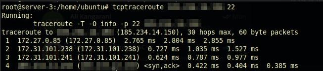

# NAT

This document is just a handy command keeper for NAT! :)

```shell
vim /etc/sysctl.conf ==> net.ipv4.ip_forward=1
iptables --table nat --append POSTROUTING --out-interface eth0 -j MASQUERADE
iptables --append FORWARD --in-interface eth1 -j ACCEPT
apt update -y && apt install iptables-persistent
iptables-save > /etc/iptables/rules.v4

```

## Challenges

Physical Server: Proxmox v7.0-11

Network Interfaces:

* Public Interface
* Private Interface: 10.0.0.60

HaProxy: Ubuntu 20.04

Network Interfaces:

* Public Interface: just IP no GW
* Private Interface: 10.0.0.70 GW: 10.0.0.60

Once after implementing the k8s cluster, I had a HaProxy VM which has two interfaces: The public and the private.
The private network had a gateway which was the physical server's local IP.
I was enabled the `ip_forward` on physical server and then wrote the `masquerade` rule on iptables to enable the `NAT`.

The problem was the time I was trying to ssh into the HaProxy VM via the public IP and I got the following error:

```shell
kex_exchange_identification: read: Connection reset by peer
```

I searched for the error all over the internet and play with the network in multiple scenarios. I only got this error when the VM has two network interfaces. Even I doubt that maybe using 10.0.0.0/24 range genrate route problems with the Iran `Interanet` range!

Here is a picture of the command to check what is the problem:



As you can see, the connection to the VM was established. I also check the `-v`(verbose) option of ssh and it proved the connection was established but something prevents the ssh to connect successfully. The public IP also has the ping!

At last I removed the `NAT` rule in iptables and the problem was solved! I used the following command instead of `Masquerade` and it's not make the previous error:

```bash
-A POSTROUTING -s 10.0.0.0/24 -o vmbr0 -j SNAT --to-source <public-ip>
```

Until writing this document I'm not found the reason why the error occurred. 

Also what are the differences between `SNAT` and `Masquerade`?

### Scenarios

1. I Changed the GW to public IP and remove the `10.0.0.60` which was the local GW. Remove all `NAT` rules. Everything was working fine.

2. On local GW it only works when using `SNAT`.

3. After changing the `SNAT` to `Masquerade` the established ssh connection was not interrupted.

   
