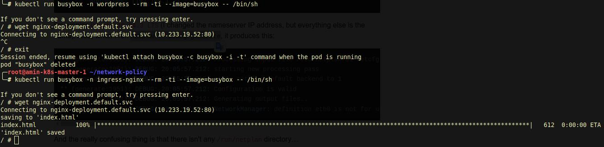

# Network Policy

## What is network policy in kubernetes?

As mentioned in kubernetes official documentation:

> If you want to control traffic flow at the IP address or port level (OSI layer 3 or 4), then you might consider using Kubernetes NetworkPolicies for particular applications in your cluster

## What is our scenario?

In our scenario we want to isolate a namespace from the other namespaces. Here we have the following challenges:

1. We need the connection between pods in the namespace
2. The ingress controller needs to communicate with pods in the namespace.

## What is the solution?

network policies need `network plugin`  to work. As mentioned in the kubernetes official documentation:

>To use network policies, you must be using a networking solution which supports NetworkPolicy. Creating a NetworkPolicy resource without a controller that implements it will have no effect.

I chose the `calico` networking solution which supports the NetworkPolicy.

In first to allow the connection between pods I apply the folloiwng manifest:

```yaml
kind: NetworkPolicy
apiVersion: networking.k8s.io/v1
metadata:
  name: allow-same-namespace
  namespace: default
spec:
  podSelector:
    matchLabels:
  ingress:
  - from:
    - podSelector: {}
```

This manifest will allow pods in same namespace(defalut namespace) to communicate and deny all other connections. To apply it:

```shell
kubectl apply -f allow-same-namespace.yaml
```

So now `ingress-controller` includes the other section. So we need to enable `ingress-nginx` namespace for all namespaces:

```yaml
kind: NetworkPolicy
apiVersion: networking.k8s.io/v1
metadata:
  name: allow-from-ingress
  namespace: default
spec:
  podSelector:
    matchLabels:
  ingress:
  - from:
    - namespaceSelector: 
        matchLabels:
          name: ingress-nginx
```

To apply it:

```shell
kubectl apply -f allow-ingress.yaml
```

Now pods are just can connect to each other in same namespace(default namespace) and ingress can connect to it. 

**Note:** Check the `ingress-nginx` namespace labels. If it doesn't contain the name label you need to add:

```shell
kubectl label namespace ingress-nginx name=ingress-nginx
```

### How to check the functionality?

You can create a simple `busybox` pod to check the NetworkPolicy functionality:

```shell
kubectl run busybox -n wordpress --rm -ti --image=busybox -- /bin/sh
```

Now try to wget other namespace's service:

```shell
wget nginx-deployment.default.svc
```

If everything is fine the connection should not established. But if you create the busybox pod in `ingress-nginx` it fetch the index.html file.



## How to apply the NetworkPolicy to all namespaces?

There is a challenge which you need to apply the NetworkPolicies to all namespaces manually. Defenetly this is not a suitable solution for production environment. There is a solution called `Kyverno` which is kubernetes policy controller which you can apply the networkPolicies when a namespace create. You can read the `kyverno` in the following link:

[Kyverno Solution](../kyverno/README.md)

## Refereneces

[Network Policy Kubernetes documentation](https://kubernetes.io/docs/concepts/services-networking/network-policies/)

