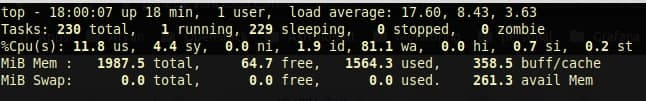
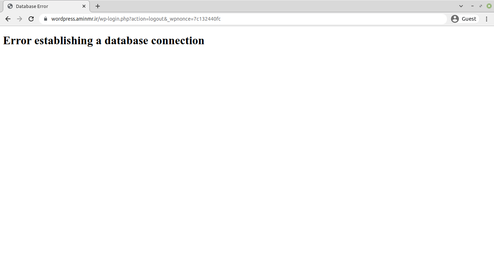

# Wordpress Stack

In this document, I deployed a simple WordPress stack with MySQL.

## Prerequisites

1. Ingress
2. Cert-Manager
3. Domain
4. StorageClass

## Installation

First of all, I prefer to deploy WordPress in a separate namespace. To create the namespace:

```yaml
apiVersion: v1
kind: Namespace
metadata:
  name: wordpress
```

For installing WordPress first of all you need a password for your MySQL. You can create the secret by the secret generator:

```shell
cat <<EOF >./kustomization.yaml
secretGenerator:
- name: mysql-pass
  literals:
  - password=YOUR_PASSWORD
EOF
```

Next, you need to prepare the WordPress and MySQL deployment configurations. You can download the sample templates via the following links:

```shell
curl -LO https://k8s.io/examples/application/wordpress/mysql-deployment.yaml
curl -LO https://k8s.io/examples/application/wordpress/wordpress-deployment.yaml
```

And also you can use the configuration are available on this repo.

You need to specify the StorageClass you use and if you have limitations in resources, limit the WordPress and MySQL resources.

Add them to kustomization.yaml file:

```shell
cat <<EOF >>./kustomization.yaml
resources:
  - mysql-deployment.yaml
  - wordpress-deployment.yaml
EOF
```

And apply and verify:

```shell
kubectl apply -k ./
```

```shell
kubectl get all -n wordpress
```

## Ingress Resource

For accessing WordPress from the outside world you need to apply the ingress resource. And also use the annotations to issue the certificate for your domain:

```yaml
apiVersion: networking.k8s.io/v1
kind: Ingress
metadata:
  name: wordpress-ingress
  annotations:
     kubernetes.io/ingress.class: "nginx"
     cert-manager.io/cluster-issuer: "letsencrypt"
spec:
  tls: 
    - hosts:
        - wordpress.aminmr.ir
      secretName: wordpress-ssl
  rules:
  - host: wordpress.aminmr.ir
    http:
      paths:
      - path: /
        pathType: Prefix
        backend:
          service:
            name: wordpress
            port:
              number: 80
```

and apply it:

```shell
kubectl apply -f ingress-resource.yaml
```

And now you can access WordPress via your domain. Enjoy it :)


## Challenges

### Node Load-Average

After deploying the MySQL deployment on the Kubernetes node, the node's high load-average is make the node down! Here is the output of the `top` command:



This problem was about the lack of memory which cause the iowait and at last the high load average. I resize the node and deploy the MySQL deployment again.

### Database error

After deploying the WordPress I got the following error:



This error was about the limitation of memory for MySQL pod. The recommended memory for MySQL is 2GB. I increase the pod's memory and the problem was solved.

## References

For further read check the following link:

[Kubernetes Wordpress](https://kubernetes.io/docs/tutorials/stateful-application/mysql-wordpress-persistent-volume/)